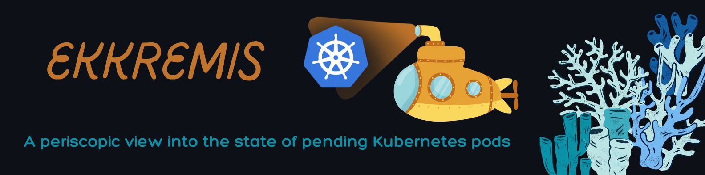
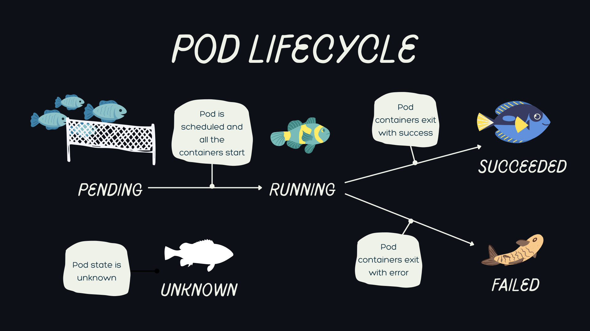
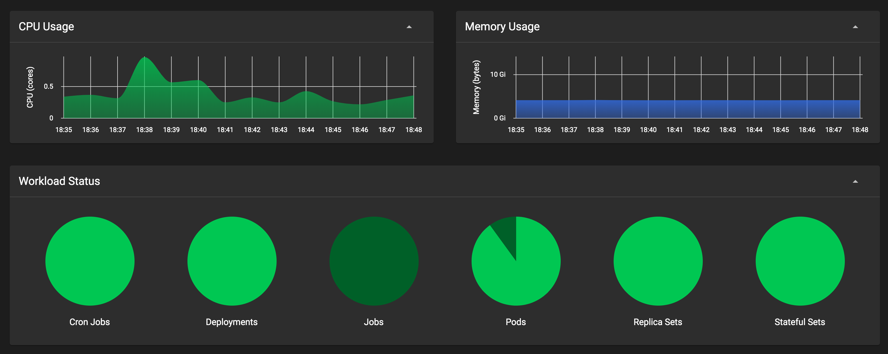

<h1 align="left"> Ekkremis </h1>  

  

  Optomize your Kubernetes pod lifecycle. Built with React Typescript with Electron/Node.js runtime.

<!-- START doctoc generated TOC please keep comment here to allow auto update -->
<!-- DON'T EDIT THIS SECTION, INSTEAD RE-RUN doctoc TO UPDATE -->
## Table of Contents

- [Introduction](#introduction)
- [Features](#features)
- [Feedback](#feedback)
- [Contributors](#contributors)
- [Alerts Setup](#alerts-setup)
- [Dashboard Build](#dashboard-build)
- [Acknowledgments](#acknowledgments)

<!-- END doctoc generated TOC please keep comment here to allow auto update -->
## Introduction

Some Kubernetes pods can't be scheduled and get stuck in a pending phase of the pod lifecycle. 

  

The status of pending pods has to be manually queried to proceed with resolving them, which slows down the deployment workflow. 

This repository contains the code for Ekkremis: a prometheus-based alertmanager to resolve kubernetes pods pending issues. Ekkremis leverages prometheus data scraping and reports back when issues interfere with scheduling along with tailored solutions. Additionally, Ekkremis has an optional lifecycle dashboard where DevOps engineers will find a consolidated view of pod metrics by state. Solutions provided by Ekkremis (greek for pending) increases Kubernetes deployment efficiency by providing updates on pending and other unhealthy pods to get them up and running faster. 

## Requirements
- Prometheus (can run demo without)
- npm (web view only)
- yarn (web or electron app)

## Features

A few of the things you can do with Ekkremis:

* Reduce manual queries to find unhealthy or pending pods 
* Receive alerts by email or slack when your pods are stuck in pending
* Implement tailored solutions suggested by Ekkremis to get your pods up and running

**Optional Ekkremis Lifecycle Dashboard.**

Lots of great screenshots coming! 

<!-- 

  

  

 -->

## Alerts Setup
<!-- 
1. `npm install` will download dependencies..
2. `pendingPods-PrometheusRulesFile.yml` contains .... -->

## Dashboard Build Process
<!-- - Follow the [React Native Guide](https://facebook.github.io/react-native/docs/getting-started.html) for getting started building a project with native code. **A Mac is required if you wish to develop for iOS.** -->

**Initial Setup**
- Clone or download the repo
- `npm install` to install dependencies

**If running Ekkremis on Web App**
- `npm run build` to create a build folder

**If running Ekkremis on Electron App**
- install yarn if you don't already have it (required for the following steps)
- `npm run postinstall` to install electron-specific dependencies
- `npm run electron:build` to build the Electron app for current platform and current architecture using default target

**Once running the app**
- Add your prometheus metrics endpoint for Kubernetes pods to the metrics input (Ekkremis defaults to http://localhost:9090)
- Navigate between pod status metric displays through the navigation bar on the left
- Gain more information about individual unhealthy or pending pods by selecting the 'error' and 'charts' buttons
- Implement solutions suggested in Ekkremis for pending pods

## Running the DEMO with Mock Data

- Add this mock promethus endpoint to the metrics input

## Feedback

If something is not behaving intuitively, it is a bug and should be reported.
Report it here by creating an issue: https://github.com/oslabs-beta/ekkremis/issues

Help us fix the problem as quickly as possible by following [Mozilla's guidelines for reporting bugs.](https://developer.mozilla.org/en-US/docs/Mozilla/QA/Bug_writing_guidelines#General_Outline_of_a_Bug_Report)

Feel free to send us feedback on [Twitter](https://twitter.com/gitpointapp) or [file an issue](https://github.com/gitpoint/git-point/issues/new). Feature requests are always welcome. If you wish to contribute, please take a quick look at the [guidelines](./CONTRIBUTING.md)!

If there's anything you'd like to chat about, please feel free to join our [Gitter chat](https://gitter.im/git-point)!

## Contributors

This project is brought to you by these [awesome contributors](./CONTRIBUTORS.md).

Please take a look at the [contributing guidelines](./CONTRIBUTING.md) for a detailed process on how to build your application as well as troubleshooting information.

## Acknowledgments

Thanks to tech accelerator [OSLabs-Beta](https://github.com/oslabs-beta) for supporting this project.

