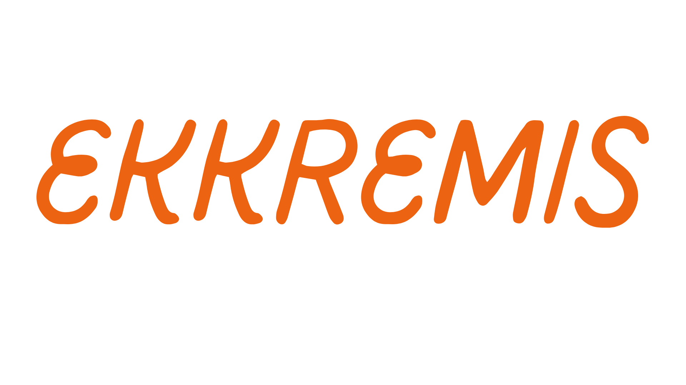

<h1 align="left"> Ekkremis </h1>  

  

  Optomize your Kubernetes pod lifecycle. Built with React Typescript with Electron/Node.js runtime.

<!-- START doctoc generated TOC please keep comment here to allow auto update -->
<!-- DON'T EDIT THIS SECTION, INSTEAD RE-RUN doctoc TO UPDATE -->
## Table of Contents

- [Introduction](#introduction)
- [Features](#features)
- [Feedback](#feedback)
- [Contributors](#contributors)
- [Dashboard Build Process](#dashboard-build-process)
- [Acknowledgments](#acknowledgments)

<!-- END doctoc generated TOC please keep comment here to allow auto update -->
## Introduction

This repository contains the code for Ekkremis: a prometheus-based alertmanager to resolve kubernetes pods stuck in pending phase complete with optional lifecycle dashboard and alerts. 
## Requirements
- Prometheus
- npm
- yarn
## Features

A few of the things you can do with Ekkremis:

* Reduce manual queries to find unhealthy or pending pods 
* Receive alerts by email or slack when your pods are stuck in pending
* Implement tailored solutions suggested by Ekkremis to get your pods up and running

  

**Optional Ekkremis Lifecycle Dashboard.**

  

  

## Alert Manager Installation Steps

1. `npm install` will download dependencies..
2. `pendingPods-PrometheusRulesFile.yml` contains ....

## Dashboard Build Process

- Follow the [React Native Guide](https://facebook.github.io/react-native/docs/getting-started.html) for getting started building a project with native code. **A Mac is required if you wish to develop for iOS.**
- Clone or download the repo
- `yarn` to install dependencies
- `yarn run link` to link react-native dependencies
- `yarn start:ios` to start the packager and run the app in the iOS simulator (`yarn start:ios:logger` will boot the application with [redux-logger](<https://github.com/evgenyrodionov/redux-logger>))
- `yarn start:android` to start the packager and run the app in the the Android device/emulator (`yarn start:android:logger` will boot the application with [redux-logger](https://github.com/evgenyrodionov/redux-logger))
## Running the DEMO with Mock Data

1. 
## Feedback

If something is not behaving intuitively, it is a bug and should be reported.
Report it here by creating an issue: https://github.com/oslabs-beta/ekkremis/issues

Help us fix the problem as quickly as possible by following [Mozilla's guidelines for reporting bugs.](https://developer.mozilla.org/en-US/docs/Mozilla/QA/Bug_writing_guidelines#General_Outline_of_a_Bug_Report)

Feel free to send us feedback on [Twitter](https://twitter.com/gitpointapp) or [file an issue](https://github.com/gitpoint/git-point/issues/new). Feature requests are always welcome. If you wish to contribute, please take a quick look at the [guidelines](./CONTRIBUTING.md)!

If there's anything you'd like to chat about, please feel free to join our [Gitter chat](https://gitter.im/git-point)!

## Contributors

This project is brought to you by these [awesome contributors](./CONTRIBUTORS.md).

Please take a look at the [contributing guidelines](./CONTRIBUTING.md) for a detailed process on how to build your application as well as troubleshooting information.

## Acknowledgments

Thanks to tech accelerator [OSLabs-Beta](https://github.com/oslabs-beta) for supporting this project.

